# 시스템 설계 문서 (System Design Document)

## 프로젝트 개요
**3D Community** - 위치기반 소셜 메타버스 플랫폼

**기술 스택:**
- Frontend: React 19 + Three.js + React Three Fiber
- Backend: Spring Boot 3.x + Spring Security + WebSocket
- Database: PostgreSQL 16+ with PostGIS
- Cache: Redis
- Real-time: WebSocket (STOMP)

---

## 1. 데이터베이스 설계

### 1.1 데이터베이스 용어 사전

데이터베이스 스키마에서 사용되는 주요 영어 용어와 한글 의미를 정리합니다.

#### 공통 용어

| 영어 | 한글 | 설명 |
|------|------|------|
| **id** | ID, 식별자 | 고유 식별 번호 (Primary Key) |
| **created_at** | 생성 일시 | 데이터 생성 시각 |
| **updated_at** | 수정 일시 | 데이터 마지막 수정 시각 |
| **is_active** | 활성 여부 | 현재 사용 중인지 여부 |
| **is_deleted** | 삭제 여부 | 소프트 삭제 표시 |

#### 사용자 관련

| 영어 | 한글 | 설명 |
|------|------|------|
| **users** | 사용자 | 회원 정보 테이블 |
| **email** | 이메일 | 로그인용 이메일 주소 |
| **username** | 사용자명 | 닉네임 |
| **password_hash** | 암호화된 비밀번호 | BCrypt로 해싱된 비밀번호 |
| **role** | 권한 | USER(일반), GM(관리자) |
| **last_login_at** | 마지막 로그인 | 마지막 접속 시각 |
| **profiles** | 프로필 | 사용자 프로필 정보 |
| **profile_image_url** | 프로필 이미지 URL | 프로필 사진 경로 |
| **status_message** | 상태 메시지 | 프로필 상태 메시지 |

#### 위치 및 공간 관련

| 영어 | 한글 | 설명 |
|------|------|------|
| **user_sessions** | 사용자 세션 | 현재 접속 공간 정보 |
| **current_space_type** | 현재 공간 유형 | PLAZA(광장) 또는 LOCAL_ROOM(로컬 방) |
| **current_room_id** | 현재 방 ID | 접속 중인 로컬 방 ID |
| **last_active_at** | 마지막 활동 | 마지막 활동 시각 (접속 여부 확인용) |

#### 로컬 방 관련

| 영어 | 한글 | 설명 |
|------|------|------|
| **local_rooms** | 로컬 방 | GPS 기반 방 정보 |
| **creator_id** | 생성자 ID | 방을 만든 사용자 ID |
| **name** | 방 이름 | 방 제목 |
| **description** | 설명 | 방 상세 설명 |
| **theme** | 테마 | 방 테마/스타일 |
| **password_hash** | 비밀번호 | 방 입장 비밀번호 (NULL=공개방) |
| **max_capacity** | 최대 인원 | 최대 수용 인원 (기본 24명) |
| **location** | GPS 위치 | PostGIS GEOGRAPHY 타입 좌표 |
| **latitude** | 위도 | GPS 위도 |
| **longitude** | 경도 | GPS 경도 |
| **current_users** | 현재 인원 | 현재 접속 중인 사용자 수 |
| **settings** | 설정 | 방 설정 (JSONB) |

#### 소셜 기능 관련

| 영어 | 한글 | 설명 |
|------|------|------|
| **friendships** | 친구 관계 | 친구 요청/수락 정보 |
| **requester_id** | 요청자 ID | 친구 요청을 보낸 사용자 |
| **addressee_id** | 수신자 ID | 친구 요청을 받은 사용자 |
| **status** | 상태 | PENDING(대기), ACCEPTED(수락), REJECTED(거절), BLOCKED(차단) |
| **messages** | 메시지 | 채팅 메시지 |
| **sender_id** | 발신자 ID | 메시지를 보낸 사용자 |
| **receiver_id** | 수신자 ID | DM 수신자 (DM인 경우만) |
| **message_type** | 메시지 타입 | PLAZA(광장), LOCAL_ROOM(로컬 방), DM(1:1) |
| **content** | 내용 | 메시지 본문 |
| **emoticon** | 이모티콘 | 이모티콘 정보 (JSONB) |
| **user_blocks** | 차단/뮤트 | 사용자 차단 정보 |
| **blocker_id** | 차단자 ID | 차단한 사용자 |
| **blocked_id** | 피차단자 ID | 차단당한 사용자 |
| **block_type** | 차단 유형 | BLOCK(차단), MUTE(뮤트) |

#### 게임 관련

| 영어 | 한글 | 설명 |
|------|------|------|
| **game_rooms** | 게임 방 | 미니게임 방 정보 |
| **game_type** | 게임 종류 | 게임 타입 (예: SNAKE, RACING) |
| **title** | 방 제목 | 게임 방 이름 |
| **max_players** | 최대 인원 | 최대 참가 가능 인원 |
| **is_public** | 공개 여부 | 공개/비공개 설정 |
| **space_type** | 공간 유형 | 게임이 생성된 공간 (PLAZA/LOCAL_ROOM) |
| **room_id** | 방 ID | 로컬 방에서 생성된 경우 해당 방 ID |
| **current_players** | 현재 인원 | 현재 참가 중인 플레이어 수 |
| **game_settings** | 게임 설정 | 게임별 설정 (JSONB) |
| **game_participants** | 게임 참가자 | 게임 참가 정보 |
| **is_spectator** | 관전자 여부 | 관전 모드 여부 |
| **join_order** | 참가 순서 | 참가한 순서 |
| **game_records** | 게임 전적 | 게임 결과 기록 |
| **result** | 결과 | WIN(승리), LOSE(패배), DRAW(무승부) |
| **score** | 점수 | 게임 점수 |
| **statistics** | 통계 | 상세 통계 (JSONB) |

#### 결제 관련

| 영어 | 한글 | 설명 |
|------|------|------|
| **payment_history** | 결제 내역 | 결제 기록 |
| **payment_gateway** | 결제 수단 | 결제 게이트웨이 (PORTONE, TOSS 등) |
| **transaction_id** | 거래 ID | 고유 거래 번호 |
| **amount** | 금액 | 결제 금액 |
| **currency** | 통화 | 화폐 단위 (기본 KRW) |
| **purchase_details** | 구매 상세 | 구매 내역 (JSONB) |
| **completed_at** | 완료 일시 | 결제 완료 시각 |

#### 게시판 관련

| 영어 | 한글 | 설명 |
|------|------|------|
| **boards** | 게시판 | 게시판 정보 |
| **posts** | 게시글 | 게시글 |
| **author_id** | 작성자 ID | 글 작성자 |
| **title** | 제목 | 게시글 제목 |
| **images** | 이미지 | 첨부 이미지 배열 |
| **view_count** | 조회수 | 게시글 조회 수 |
| **like_count** | 좋아요 수 | 좋아요 개수 |
| **comments** | 댓글 | 댓글 |
| **post_id** | 게시글 ID | 댓글이 달린 게시글 |
| **parent_comment_id** | 부모 댓글 ID | 대댓글인 경우 원댓글 ID |
| **likes** | 좋아요 | 좋아요 정보 |
| **target_type** | 대상 타입 | POST(게시글), COMMENT(댓글) |
| **target_id** | 대상 ID | 좋아요 대상 ID |

#### 시스템 관련

| 영어 | 한글 | 설명 |
|------|------|------|
| **announcements** | 공지사항 | 공지사항 |
| **priority** | 우선순위 | 표시 우선순위 (높을수록 상단) |
| **start_date** | 시작일 | 공지 시작 날짜 |
| **end_date** | 종료일 | 공지 종료 날짜 |
| **reports** | 신고 | 신고 내역 |
| **reporter_id** | 신고자 ID | 신고한 사용자 |
| **reason** | 사유 | 신고 사유 |
| **admin_note** | 관리자 메모 | 처리 내용 메모 |
| **resolved_at** | 처리 일시 | 신고 처리 완료 시각 |

---

### 1.2 DBMS 선택

**PostgreSQL 16+ with PostGIS Extension**

**선택 이유:**
1. **PostGIS**: 위치 기반 쿼리 최적화 (반경 5km 검색, 거리 계산)
2. **RLS (Row Level Security)**: 공간별 데이터 격리 (광장/로컬 방)
3. **JSONB**: 유연한 설정 데이터 저장 (캐릭터 커스터마이징, 방 설정)
4. **성능**: 동시 접속 1,000명 지원 가능
5. **Spring Boot 통합**: JPA/Hibernate 완벽 지원

---

### 1.2 데이터베이스 스키마

#### 1.2.1 사용자 관리

```sql
-- 사용자 기본 정보
CREATE TABLE users (
    id BIGSERIAL PRIMARY KEY,
    email VARCHAR(255) UNIQUE NOT NULL,
    username VARCHAR(50) UNIQUE NOT NULL,
    password_hash VARCHAR(255) NOT NULL, -- BCrypt
    role VARCHAR(20) DEFAULT 'USER' CHECK (role IN ('USER', 'GM')),
    created_at TIMESTAMP DEFAULT CURRENT_TIMESTAMP,
    updated_at TIMESTAMP DEFAULT CURRENT_TIMESTAMP,
    last_login_at TIMESTAMP,
    is_active BOOLEAN DEFAULT true,
    is_deleted BOOLEAN DEFAULT false
);

CREATE INDEX idx_users_email ON users(email);
CREATE INDEX idx_users_username ON users(username);
CREATE INDEX idx_users_role ON users(role);

-- 프로필 정보
CREATE TABLE profiles (
    user_id BIGINT PRIMARY KEY REFERENCES users(id) ON DELETE CASCADE,
    profile_image_url TEXT,
    status_message VARCHAR(200),

    created_at TIMESTAMP DEFAULT CURRENT_TIMESTAMP,
    updated_at TIMESTAMP DEFAULT CURRENT_TIMESTAMP
);

-- 사용자 세션 정보 (현재 접속 공간)
CREATE TABLE user_sessions (
    user_id BIGINT PRIMARY KEY REFERENCES users(id) ON DELETE CASCADE,

    -- 현재 위치한 공간
    current_space_type VARCHAR(20) NOT NULL CHECK (current_space_type IN ('PLAZA', 'LOCAL_ROOM')),
    current_room_id BIGINT REFERENCES local_rooms(id) ON DELETE SET NULL,

    -- 접속 상태
    last_active_at TIMESTAMP DEFAULT CURRENT_TIMESTAMP,

    updated_at TIMESTAMP DEFAULT CURRENT_TIMESTAMP
);

-- 참고: 3D 좌표(position_x/y/z), 회전(rotation_y), 애니메이션 상태는
-- WebSocket으로만 실시간 전송하며 DB에 저장하지 않음

CREATE INDEX idx_user_sessions_space ON user_sessions(current_space_type, current_room_id);
```

#### 1.2.2 위치 기반 로컬 방

```sql
-- PostGIS 확장 활성화
CREATE EXTENSION IF NOT EXISTS postgis;

-- 로컬 방
CREATE TABLE local_rooms (
    id BIGSERIAL PRIMARY KEY,
    creator_id BIGINT NOT NULL REFERENCES users(id) ON DELETE CASCADE,

    -- 방 정보
    name VARCHAR(100) NOT NULL,
    description TEXT,
    theme VARCHAR(50) DEFAULT 'default',
    password_hash VARCHAR(255), -- NULL이면 공개방
    max_capacity INTEGER DEFAULT 24 CHECK (max_capacity > 0 AND max_capacity <= 24),

    -- GPS 위치 (PostGIS GEOGRAPHY - WGS84 좌표계)
    location GEOGRAPHY(POINT, 4326) NOT NULL,

    -- 위도/경도 (검색용 인덱스)
    latitude DECIMAL(10, 7) NOT NULL,
    longitude DECIMAL(10, 7) NOT NULL,

    -- 현재 접속자 수
    current_users INTEGER DEFAULT 0 CHECK (current_users >= 0),

    -- 방 설정 (JSONB)
    settings JSONB DEFAULT '{
        "allow_mini_games": true,
        "chat_enabled": true,
        "theme_color": "#ffffff"
    }'::jsonb,

    created_at TIMESTAMP DEFAULT CURRENT_TIMESTAMP,
    updated_at TIMESTAMP DEFAULT CURRENT_TIMESTAMP,
    is_active BOOLEAN DEFAULT true
);

-- PostGIS 공간 인덱스 (반경 검색 최적화)
CREATE INDEX idx_local_rooms_location ON local_rooms USING GIST(location);
CREATE INDEX idx_local_rooms_creator ON local_rooms(creator_id);
CREATE INDEX idx_local_rooms_active ON local_rooms(is_active) WHERE is_active = true;

-- 1인당 1개 방 제약 조건
CREATE UNIQUE INDEX idx_one_room_per_user ON local_rooms(creator_id)
    WHERE is_active = true;

-- 반경 5km 내 방 검색 함수
CREATE OR REPLACE FUNCTION get_nearby_rooms(
    user_lat DECIMAL,
    user_lng DECIMAL,
    radius_meters INTEGER DEFAULT 5000
)
RETURNS TABLE(
    room_id BIGINT,
    room_name VARCHAR,
    distance_meters DECIMAL,
    current_users INTEGER,
    max_capacity INTEGER,
    has_password BOOLEAN
) AS $$
BEGIN
    RETURN QUERY
    SELECT
        lr.id,
        lr.name,
        ST_Distance(
            lr.location,
            ST_SetSRID(ST_MakePoint(user_lng, user_lat), 4326)::geography
        )::DECIMAL as distance,
        lr.current_users,
        lr.max_capacity,
        (lr.password_hash IS NOT NULL) as has_password
    FROM local_rooms lr
    WHERE
        lr.is_active = true
        AND ST_DWithin(
            lr.location,
            ST_SetSRID(ST_MakePoint(user_lng, user_lat), 4326)::geography,
            radius_meters
        )
    ORDER BY distance ASC;
END;
$$ LANGUAGE plpgsql;
```

#### 1.2.3 소셜 기능

```sql
-- 친구 관계
CREATE TABLE friendships (
    id BIGSERIAL PRIMARY KEY,
    requester_id BIGINT NOT NULL REFERENCES users(id) ON DELETE CASCADE,
    addressee_id BIGINT NOT NULL REFERENCES users(id) ON DELETE CASCADE,
    status VARCHAR(20) DEFAULT 'PENDING' CHECK (status IN ('PENDING', 'ACCEPTED', 'REJECTED', 'BLOCKED')),
    created_at TIMESTAMP DEFAULT CURRENT_TIMESTAMP,
    updated_at TIMESTAMP DEFAULT CURRENT_TIMESTAMP,

    -- 양방향 중복 방지
    UNIQUE(requester_id, addressee_id),
    CHECK (requester_id != addressee_id)
);

CREATE INDEX idx_friendships_requester ON friendships(requester_id, status);
CREATE INDEX idx_friendships_addressee ON friendships(addressee_id, status);

-- 채팅 메시지
CREATE TABLE messages (
    id BIGSERIAL PRIMARY KEY,
    sender_id BIGINT NOT NULL REFERENCES users(id) ON DELETE CASCADE,

    -- 메시지 타입
    message_type VARCHAR(20) NOT NULL CHECK (message_type IN ('PLAZA', 'LOCAL_ROOM', 'DM')),

    -- 공간 정보 (PLAZA/LOCAL_ROOM일 때)
    room_id BIGINT REFERENCES local_rooms(id) ON DELETE CASCADE,

    -- DM 수신자 (DM일 때)
    receiver_id BIGINT REFERENCES users(id) ON DELETE CASCADE,

    -- 메시지 내용
    content TEXT NOT NULL,

    -- 이모티콘 정보 (JSONB)
    emoticon JSONB,

    created_at TIMESTAMP DEFAULT CURRENT_TIMESTAMP,
    is_deleted BOOLEAN DEFAULT false,

    -- 제약 조건
    CHECK (
        (message_type = 'DM' AND receiver_id IS NOT NULL AND room_id IS NULL) OR
        (message_type = 'LOCAL_ROOM' AND room_id IS NOT NULL AND receiver_id IS NULL) OR
        (message_type = 'PLAZA' AND room_id IS NULL AND receiver_id IS NULL)
    )
);

CREATE INDEX idx_messages_type_room ON messages(message_type, room_id, created_at DESC);
CREATE INDEX idx_messages_dm ON messages(sender_id, receiver_id, created_at DESC) WHERE message_type = 'DM';
CREATE INDEX idx_messages_created ON messages(created_at DESC);

-- 차단/뮤트
CREATE TABLE user_blocks (
    id BIGSERIAL PRIMARY KEY,
    blocker_id BIGINT NOT NULL REFERENCES users(id) ON DELETE CASCADE,
    blocked_id BIGINT NOT NULL REFERENCES users(id) ON DELETE CASCADE,
    block_type VARCHAR(20) NOT NULL CHECK (block_type IN ('BLOCK', 'MUTE')),
    created_at TIMESTAMP DEFAULT CURRENT_TIMESTAMP,

    UNIQUE(blocker_id, blocked_id, block_type),
    CHECK (blocker_id != blocked_id)
);

CREATE INDEX idx_user_blocks_blocker ON user_blocks(blocker_id, block_type);
```

#### 1.2.4 미니게임 시스템

```sql
-- 게임 방
CREATE TABLE game_rooms (
    id BIGSERIAL PRIMARY KEY,
    creator_id BIGINT NOT NULL REFERENCES users(id) ON DELETE CASCADE,

    -- 게임 정보
    game_type VARCHAR(50) NOT NULL, -- 예: 'SNAKE', 'RACING', etc.
    title VARCHAR(100) NOT NULL,
    max_players INTEGER NOT NULL CHECK (max_players > 0),
    is_public BOOLEAN DEFAULT true,
    password_hash VARCHAR(255),

    -- 공간 정보 (게임이 생성된 위치)
    space_type VARCHAR(20) NOT NULL CHECK (space_type IN ('PLAZA', 'LOCAL_ROOM')),
    room_id BIGINT REFERENCES local_rooms(id) ON DELETE CASCADE,

    -- 게임 상태
    status VARCHAR(20) DEFAULT 'WAITING' CHECK (status IN ('WAITING', 'PLAYING', 'FINISHED')),
    current_players INTEGER DEFAULT 1 CHECK (current_players >= 0),

    -- 게임 설정 (JSONB)
    game_settings JSONB DEFAULT '{}'::jsonb,

    created_at TIMESTAMP DEFAULT CURRENT_TIMESTAMP,
    started_at TIMESTAMP,
    finished_at TIMESTAMP,

    CHECK (
        (space_type = 'LOCAL_ROOM' AND room_id IS NOT NULL) OR
        (space_type = 'PLAZA' AND room_id IS NULL)
    )
);

CREATE INDEX idx_game_rooms_status ON game_rooms(status, space_type, room_id);
CREATE INDEX idx_game_rooms_type ON game_rooms(game_type, status);

-- 게임 참가자
CREATE TABLE game_participants (
    id BIGSERIAL PRIMARY KEY,
    game_room_id BIGINT NOT NULL REFERENCES game_rooms(id) ON DELETE CASCADE,
    user_id BIGINT NOT NULL REFERENCES users(id) ON DELETE CASCADE,

    -- 참가 상태
    is_spectator BOOLEAN DEFAULT false,
    join_order INTEGER NOT NULL, -- 참가 순서

    joined_at TIMESTAMP DEFAULT CURRENT_TIMESTAMP,
    left_at TIMESTAMP,

    UNIQUE(game_room_id, user_id)
);

CREATE INDEX idx_game_participants_room ON game_participants(game_room_id);
CREATE INDEX idx_game_participants_user ON game_participants(user_id);

-- 게임 전적 (선택사항)
CREATE TABLE game_records (
    id BIGSERIAL PRIMARY KEY,
    game_room_id BIGINT NOT NULL REFERENCES game_rooms(id) ON DELETE CASCADE,
    user_id BIGINT NOT NULL REFERENCES users(id) ON DELETE CASCADE,
    game_type VARCHAR(50) NOT NULL,

    -- 결과
    result VARCHAR(20) CHECK (result IN ('WIN', 'LOSE', 'DRAW')),
    score INTEGER,

    -- 상세 통계 (JSONB)
    statistics JSONB DEFAULT '{}'::jsonb,

    played_at TIMESTAMP DEFAULT CURRENT_TIMESTAMP
);

CREATE INDEX idx_game_records_user ON game_records(user_id, game_type, played_at DESC);
CREATE INDEX idx_game_records_game ON game_records(game_room_id);
```

#### 1.2.5 상점 및 결제 (v2 - 추후 확장)

```sql
-- 결제 내역 (실제 결제 기능 구현 시)
CREATE TABLE payment_history (
    id BIGSERIAL PRIMARY KEY,
    user_id BIGINT NOT NULL REFERENCES users(id) ON DELETE CASCADE,

    -- 결제 정보
    payment_gateway VARCHAR(50) NOT NULL, -- 'PORTONE', 'TOSS', 'KAKAOPAY'
    transaction_id VARCHAR(255) UNIQUE NOT NULL,

    -- 금액
    amount INTEGER NOT NULL,
    currency VARCHAR(10) DEFAULT 'KRW',

    -- 결제 상태
    status VARCHAR(20) DEFAULT 'PENDING' CHECK (status IN ('PENDING', 'COMPLETED', 'FAILED', 'REFUNDED')),

    -- 구매 내역 (JSONB)
    purchase_details JSONB NOT NULL,

    created_at TIMESTAMP DEFAULT CURRENT_TIMESTAMP,
    completed_at TIMESTAMP
);

CREATE INDEX idx_payment_history_user ON payment_history(user_id, created_at DESC);
CREATE INDEX idx_payment_history_transaction ON payment_history(transaction_id);

-- 참고: 아이템 카탈로그, 인벤토리 등은 Phase 2-3에서 구현 예정
```

#### 1.2.6 게시판 (v2)

```sql
-- 게시판
CREATE TABLE boards (
    id BIGSERIAL PRIMARY KEY,
    name VARCHAR(50) NOT NULL UNIQUE,
    description TEXT,
    category VARCHAR(50) CHECK (category IN ('FREE', 'STRATEGY', 'SUGGESTION')),
    created_at TIMESTAMP DEFAULT CURRENT_TIMESTAMP
);

-- 게시글
CREATE TABLE posts (
    id BIGSERIAL PRIMARY KEY,
    board_id BIGINT NOT NULL REFERENCES boards(id) ON DELETE CASCADE,
    author_id BIGINT NOT NULL REFERENCES users(id) ON DELETE CASCADE,

    title VARCHAR(200) NOT NULL,
    content TEXT NOT NULL,

    -- 이미지 (배열)
    images TEXT[],

    -- 통계
    view_count INTEGER DEFAULT 0,
    like_count INTEGER DEFAULT 0,

    created_at TIMESTAMP DEFAULT CURRENT_TIMESTAMP,
    updated_at TIMESTAMP DEFAULT CURRENT_TIMESTAMP,
    is_deleted BOOLEAN DEFAULT false
);

CREATE INDEX idx_posts_board ON posts(board_id, created_at DESC);
CREATE INDEX idx_posts_author ON posts(author_id);

-- 댓글
CREATE TABLE comments (
    id BIGSERIAL PRIMARY KEY,
    post_id BIGINT NOT NULL REFERENCES posts(id) ON DELETE CASCADE,
    author_id BIGINT NOT NULL REFERENCES users(id) ON DELETE CASCADE,
    parent_comment_id BIGINT REFERENCES comments(id) ON DELETE CASCADE,

    content TEXT NOT NULL,
    like_count INTEGER DEFAULT 0,

    created_at TIMESTAMP DEFAULT CURRENT_TIMESTAMP,
    updated_at TIMESTAMP DEFAULT CURRENT_TIMESTAMP,
    is_deleted BOOLEAN DEFAULT false
);

CREATE INDEX idx_comments_post ON comments(post_id, created_at ASC);
CREATE INDEX idx_comments_parent ON comments(parent_comment_id);

-- 좋아요
CREATE TABLE likes (
    id BIGSERIAL PRIMARY KEY,
    user_id BIGINT NOT NULL REFERENCES users(id) ON DELETE CASCADE,
    target_type VARCHAR(20) NOT NULL CHECK (target_type IN ('POST', 'COMMENT')),
    target_id BIGINT NOT NULL,

    created_at TIMESTAMP DEFAULT CURRENT_TIMESTAMP,

    UNIQUE(user_id, target_type, target_id)
);

CREATE INDEX idx_likes_target ON likes(target_type, target_id);
```

#### 1.2.7 시스템

```sql
-- 공지사항
CREATE TABLE announcements (
    id BIGSERIAL PRIMARY KEY,
    author_id BIGINT NOT NULL REFERENCES users(id) ON DELETE CASCADE,

    title VARCHAR(200) NOT NULL,
    content TEXT NOT NULL,

    -- 우선순위 (높을수록 상단 노출)
    priority INTEGER DEFAULT 0,

    -- 표시 기간
    start_date TIMESTAMP NOT NULL,
    end_date TIMESTAMP,

    created_at TIMESTAMP DEFAULT CURRENT_TIMESTAMP,
    updated_at TIMESTAMP DEFAULT CURRENT_TIMESTAMP,
    is_active BOOLEAN DEFAULT true
);

CREATE INDEX idx_announcements_active ON announcements(is_active, priority DESC, created_at DESC);

-- 신고
CREATE TABLE reports (
    id BIGSERIAL PRIMARY KEY,
    reporter_id BIGINT NOT NULL REFERENCES users(id) ON DELETE CASCADE,

    -- 신고 대상
    target_type VARCHAR(20) NOT NULL CHECK (target_type IN ('USER', 'POST', 'COMMENT', 'MESSAGE')),
    target_id BIGINT NOT NULL,

    reason VARCHAR(50) NOT NULL,
    description TEXT,

    -- 처리 상태
    status VARCHAR(20) DEFAULT 'PENDING' CHECK (status IN ('PENDING', 'REVIEWING', 'RESOLVED', 'REJECTED')),
    admin_note TEXT,

    created_at TIMESTAMP DEFAULT CURRENT_TIMESTAMP,
    resolved_at TIMESTAMP
);

CREATE INDEX idx_reports_status ON reports(status, created_at DESC);
CREATE INDEX idx_reports_target ON reports(target_type, target_id);
```

---

### 1.3 Row Level Security (RLS) 정책

PostgreSQL의 RLS를 사용하여 데이터 접근 제어를 데이터베이스 레벨에서 처리합니다.

```sql
-- RLS 활성화
ALTER TABLE messages ENABLE ROW LEVEL SECURITY;
ALTER TABLE user_sessions ENABLE ROW LEVEL SECURITY;
ALTER TABLE game_rooms ENABLE ROW LEVEL SECURITY;

-- 1. 채팅 메시지 RLS
-- 광장 채팅: 광장에 있는 사용자만 조회 가능
CREATE POLICY "plaza_chat_read" ON messages
    FOR SELECT
    USING (
        message_type = 'PLAZA' AND
        EXISTS (
            SELECT 1 FROM user_sessions
            WHERE user_id = current_user_id() -- Spring Security에서 제공하는 함수
            AND current_space_type = 'PLAZA'
        )
    );

-- 로컬 방 채팅: 해당 방에 있는 사용자만 조회 가능
CREATE POLICY "local_room_chat_read" ON messages
    FOR SELECT
    USING (
        message_type = 'LOCAL_ROOM' AND
        EXISTS (
            SELECT 1 FROM user_sessions
            WHERE user_id = current_user_id()
            AND current_space_type = 'LOCAL_ROOM'
            AND current_room_id = messages.room_id
        )
    );

-- DM: 송신자 또는 수신자만 조회 가능
CREATE POLICY "dm_read" ON messages
    FOR SELECT
    USING (
        message_type = 'DM' AND
        (sender_id = current_user_id() OR receiver_id = current_user_id())
    );

-- 2. 사용자 세션 RLS
-- 같은 공간에 있는 사용자만 조회 가능
CREATE POLICY "same_space_session_read" ON user_sessions
    FOR SELECT
    USING (
        EXISTS (
            SELECT 1 FROM user_sessions my_session
            WHERE my_session.user_id = current_user_id()
            AND my_session.current_space_type = user_sessions.current_space_type
            AND (
                my_session.current_space_type = 'PLAZA' OR
                my_session.current_room_id = user_sessions.current_room_id
            )
        )
    );

-- 3. 게임 방 RLS
-- 같은 공간의 게임만 조회 가능
CREATE POLICY "same_space_game_read" ON game_rooms
    FOR SELECT
    USING (
        EXISTS (
            SELECT 1 FROM user_sessions
            WHERE user_id = current_user_id()
            AND current_space_type = game_rooms.space_type
            AND (
                current_space_type = 'PLAZA' OR
                current_room_id = game_rooms.room_id
            )
        )
    );

-- current_user_id() 함수 (Spring Security Context에서 가져옴)
-- 실제로는 Spring Boot에서 SET LOCAL로 세션 변수 설정
-- SET LOCAL app.current_user_id = '123';
CREATE OR REPLACE FUNCTION current_user_id()
RETURNS BIGINT AS $$
BEGIN
    RETURN NULLIF(current_setting('app.current_user_id', TRUE), '')::BIGINT;
END;
$$ LANGUAGE plpgsql STABLE;
```

---

### 1.4 인덱스 전략

#### 1.4.1 복합 인덱스
```sql
-- 자주 함께 조회되는 컬럼
CREATE INDEX idx_messages_space_time ON messages(message_type, room_id, created_at DESC);
CREATE INDEX idx_user_sessions_space_room ON user_sessions(current_space_type, current_room_id);
CREATE INDEX idx_game_rooms_space_status ON game_rooms(space_type, room_id, status);
```

#### 1.4.2 부분 인덱스
```sql
-- 활성 데이터만 인덱싱
CREATE INDEX idx_local_rooms_active ON local_rooms(is_active) WHERE is_active = true;
CREATE INDEX idx_users_active ON users(is_active) WHERE is_active = true;
CREATE INDEX idx_game_rooms_waiting ON game_rooms(status) WHERE status = 'WAITING';
```

#### 1.4.3 공간 인덱스 (PostGIS)
```sql
-- GIST 인덱스로 반경 검색 최적화
CREATE INDEX idx_local_rooms_location ON local_rooms USING GIST(location);
```

---

### 1.5 데이터 정합성 및 제약 조건

#### 1.5.1 Trigger - 자동 업데이트

```sql
-- updated_at 자동 갱신 함수
CREATE OR REPLACE FUNCTION update_updated_at_column()
RETURNS TRIGGER AS $$
BEGIN
    NEW.updated_at = CURRENT_TIMESTAMP;
    RETURN NEW;
END;
$$ LANGUAGE plpgsql;

-- 트리거 적용
CREATE TRIGGER update_users_updated_at BEFORE UPDATE ON users
    FOR EACH ROW EXECUTE FUNCTION update_updated_at_column();

CREATE TRIGGER update_profiles_updated_at BEFORE UPDATE ON profiles
    FOR EACH ROW EXECUTE FUNCTION update_updated_at_column();

CREATE TRIGGER update_local_rooms_updated_at BEFORE UPDATE ON local_rooms
    FOR EACH ROW EXECUTE FUNCTION update_updated_at_column();

-- 로컬 방 인원 수 자동 업데이트
CREATE OR REPLACE FUNCTION update_room_user_count()
RETURNS TRIGGER AS $$
BEGIN
    IF TG_OP = 'INSERT' THEN
        IF NEW.current_space_type = 'LOCAL_ROOM' AND NEW.current_room_id IS NOT NULL THEN
            UPDATE local_rooms
            SET current_users = current_users + 1
            WHERE id = NEW.current_room_id;
        END IF;
    ELSIF TG_OP = 'UPDATE' THEN
        -- 방에서 나감
        IF OLD.current_space_type = 'LOCAL_ROOM' AND OLD.current_room_id IS NOT NULL THEN
            UPDATE local_rooms
            SET current_users = current_users - 1
            WHERE id = OLD.current_room_id;
        END IF;
        -- 새 방에 입장
        IF NEW.current_space_type = 'LOCAL_ROOM' AND NEW.current_room_id IS NOT NULL THEN
            UPDATE local_rooms
            SET current_users = current_users + 1
            WHERE id = NEW.current_room_id;
        END IF;
    ELSIF TG_OP = 'DELETE' THEN
        IF OLD.current_space_type = 'LOCAL_ROOM' AND OLD.current_room_id IS NOT NULL THEN
            UPDATE local_rooms
            SET current_users = current_users - 1
            WHERE id = OLD.current_room_id;
        END IF;
    END IF;
    RETURN NEW;
END;
$$ LANGUAGE plpgsql;

CREATE TRIGGER trigger_update_room_user_count
    AFTER INSERT OR UPDATE OR DELETE ON user_sessions
    FOR EACH ROW EXECUTE FUNCTION update_room_user_count();

-- 게임 방 인원 수 자동 업데이트
CREATE OR REPLACE FUNCTION update_game_player_count()
RETURNS TRIGGER AS $$
BEGIN
    IF TG_OP = 'INSERT' THEN
        UPDATE game_rooms
        SET current_players = current_players + 1
        WHERE id = NEW.game_room_id;
    ELSIF TG_OP = 'DELETE' THEN
        UPDATE game_rooms
        SET current_players = current_players - 1
        WHERE id = OLD.game_room_id;
    END IF;
    RETURN NEW;
END;
$$ LANGUAGE plpgsql;

CREATE TRIGGER trigger_update_game_player_count
    AFTER INSERT OR DELETE ON game_participants
    FOR EACH ROW EXECUTE FUNCTION update_game_player_count();

-- 좋아요 카운트 자동 업데이트
CREATE OR REPLACE FUNCTION update_like_count()
RETURNS TRIGGER AS $$
BEGIN
    IF TG_OP = 'INSERT' THEN
        IF NEW.target_type = 'POST' THEN
            UPDATE posts SET like_count = like_count + 1 WHERE id = NEW.target_id;
        ELSIF NEW.target_type = 'COMMENT' THEN
            UPDATE comments SET like_count = like_count + 1 WHERE id = NEW.target_id;
        END IF;
    ELSIF TG_OP = 'DELETE' THEN
        IF OLD.target_type = 'POST' THEN
            UPDATE posts SET like_count = like_count - 1 WHERE id = OLD.target_id;
        ELSIF OLD.target_type = 'COMMENT' THEN
            UPDATE comments SET like_count = like_count - 1 WHERE id = OLD.target_id;
        END IF;
    END IF;
    RETURN NEW;
END;
$$ LANGUAGE plpgsql;

CREATE TRIGGER trigger_update_like_count
    AFTER INSERT OR DELETE ON likes
    FOR EACH ROW EXECUTE FUNCTION update_like_count();
```

#### 1.5.2 비즈니스 로직 제약

```sql
-- 로컬 방 인원 제한 체크
CREATE OR REPLACE FUNCTION check_room_capacity()
RETURNS TRIGGER AS $$
DECLARE
    room_capacity INTEGER;
    room_current INTEGER;
BEGIN
    IF NEW.current_space_type = 'LOCAL_ROOM' AND NEW.current_room_id IS NOT NULL THEN
        SELECT max_capacity, current_users INTO room_capacity, room_current
        FROM local_rooms WHERE id = NEW.current_room_id;

        IF room_current >= room_capacity THEN
            RAISE EXCEPTION '방 인원이 가득 찼습니다. (현재: %, 최대: %)', room_current, room_capacity;
        END IF;
    END IF;
    RETURN NEW;
END;
$$ LANGUAGE plpgsql;

CREATE TRIGGER trigger_check_room_capacity
    BEFORE INSERT OR UPDATE ON user_sessions
    FOR EACH ROW EXECUTE FUNCTION check_room_capacity();
```

---

### 1.6 초기 데이터 (Seeds)

```sql
-- 기본 게시판 생성 (v2에서 구현)
INSERT INTO boards (name, description, category) VALUES
('자유 게시판', '자유롭게 이야기를 나누는 공간', 'FREE'),
('공략 게시판', '게임 공략 및 팁 공유', 'STRATEGY'),
('건의 게시판', '서비스 개선 건의', 'SUGGESTION');

-- 참고: 캐릭터는 BaseCharacter.gltf 단일 모델 사용
-- 커스터마이징 및 아이템 시스템은 추후 확장 예정
```

---

## 2. 데이터 흐름도 (Data Flow Diagram)

### 2.1 전체 시스템 데이터 흐름

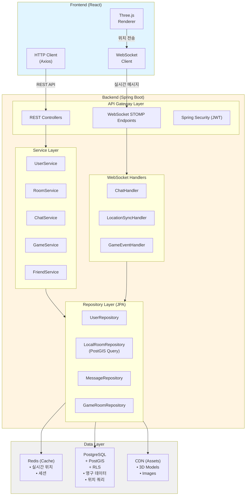

### 2.2 주요 기능별 데이터 흐름

#### 2.2.1 사용자 인증 흐름

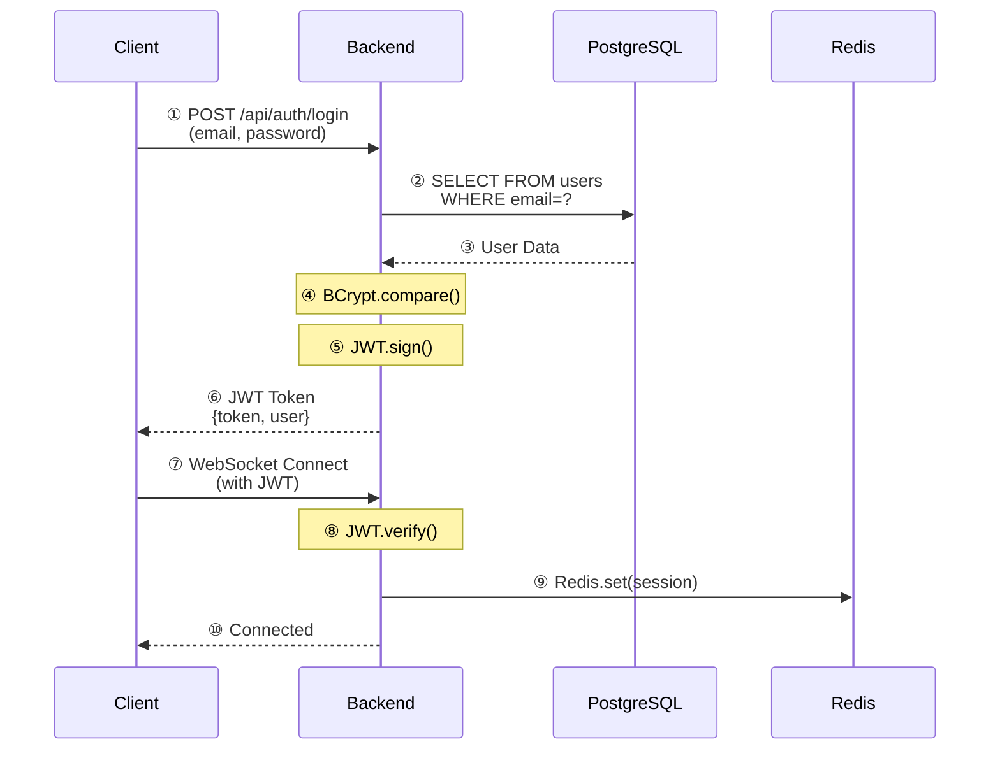

#### 2.2.2 로컬 방 생성 및 검색 흐름

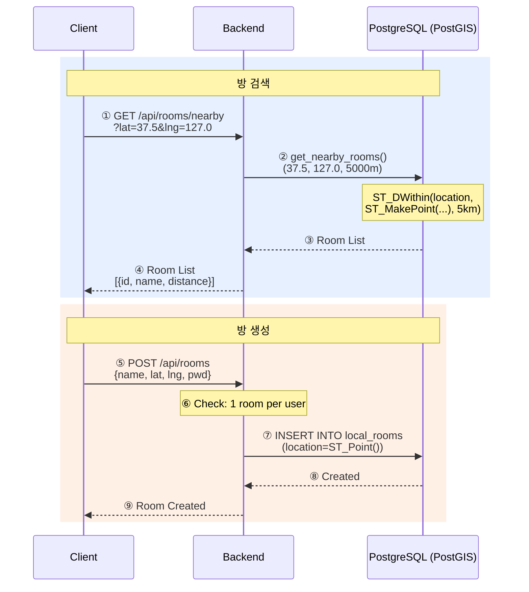

#### 2.2.3 공간별 채팅 흐름 (RLS 적용)

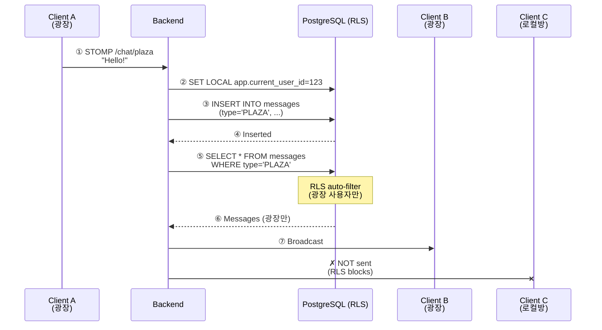

#### 2.2.4 실시간 위치 동기화 흐름

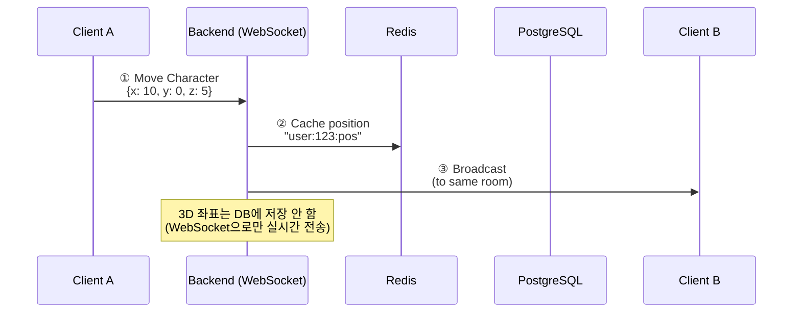

#### 2.2.5 미니게임 참가 흐름

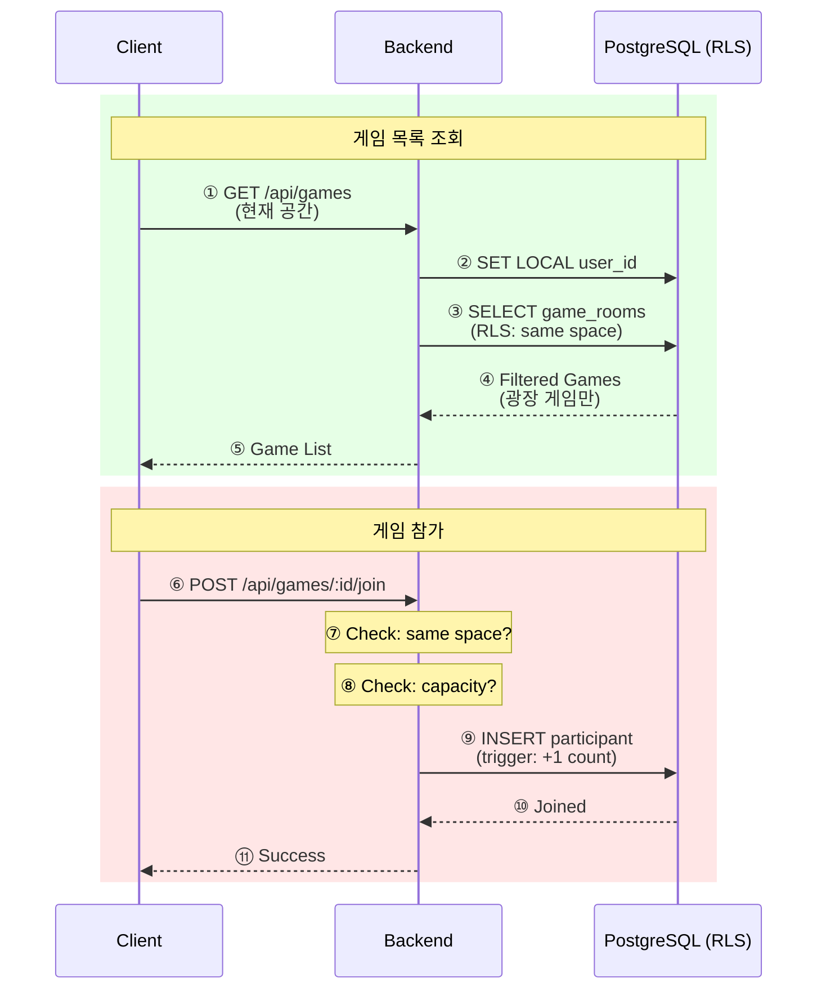

---

### 2.3 Redis 캐싱 전략

#### 2.3.1 캐시 사용 데이터

```
┌─────────────────────────────────────────────────────┐
│                    Redis Cache                      │
├─────────────────────────────────────────────────────┤
│ Key Pattern                     │ TTL   │ 용도      │
├─────────────────────────────────┼───────┼──────────┤
│ user:{id}:session               │ 24h   │ JWT 세션  │
│ user:{id}:location              │ 10s   │ 실시간위치│
│ room:{id}:users                 │ 30s   │ 방 인원   │
│ plaza:users                     │ 10s   │ 광장 인원 │
│ chat:plaza:recent               │ 5m    │ 최근채팅  │
│ chat:room:{id}:recent           │ 5m    │ 방 채팅   │
│ game:{id}:state                 │ -     │ 게임 상태 │
└─────────────────────────────────┴───────┴──────────┘
```

#### 2.3.2 Cache-Aside Pattern

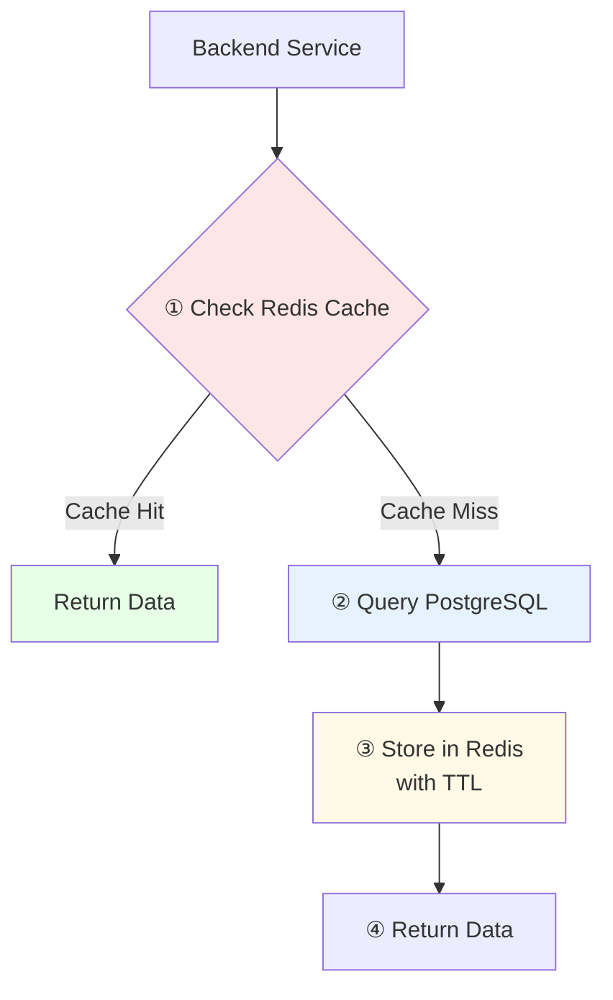

---

### 2.4 데이터 일관성 전략

#### 2.4.1 Eventually Consistent (최종 일관성)

**실시간 위치 데이터:**
```
Redis (실시간) ──┐
                 ├─→ 클라이언트는 Redis 데이터 사용
PostgreSQL (5초)─┘   PostgreSQL은 로그/분석용
```

#### 2.4.2 Strong Consistency (강한 일관성)

**중요 트랜잭션 (결제, 게임 결과 등):**
```
PostgreSQL Transaction (ACID)
BEGIN;
    INSERT INTO payment_history ...;
    INSERT INTO user_inventory ...;
    UPDATE users SET coins = coins - 1000 ...;
COMMIT;
```

---

## 3. 화면 흐름 설계 (UI Flow Design)

### 3.1 전체 화면 전환 다이어그램

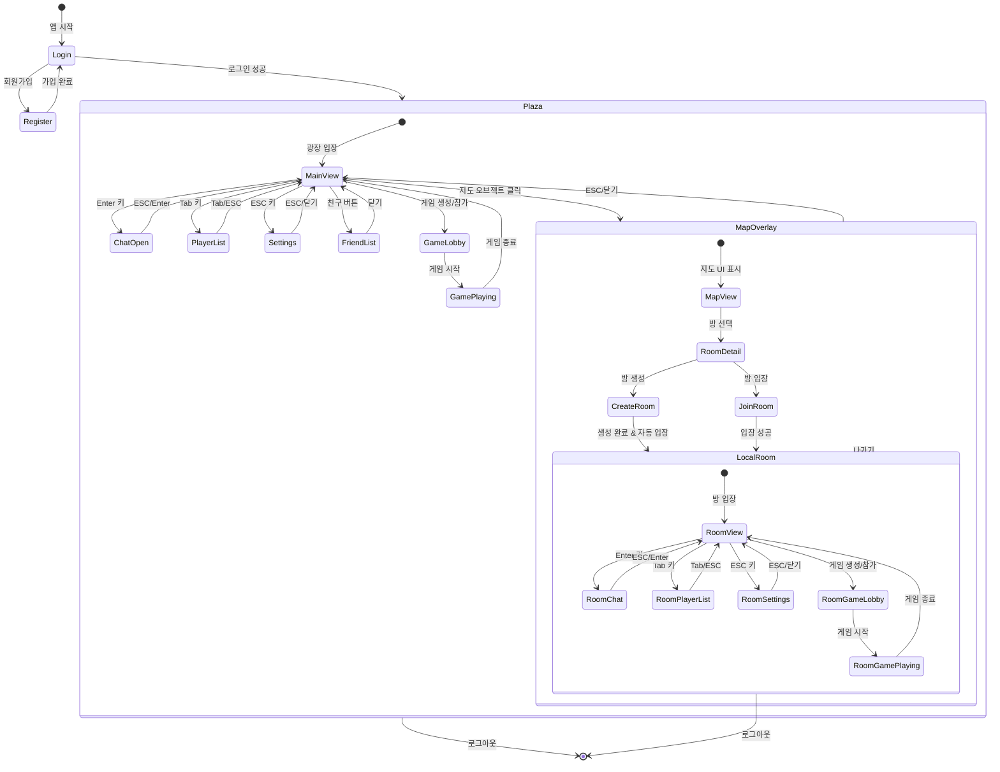

---

### 3.2 UI 레이어 구조

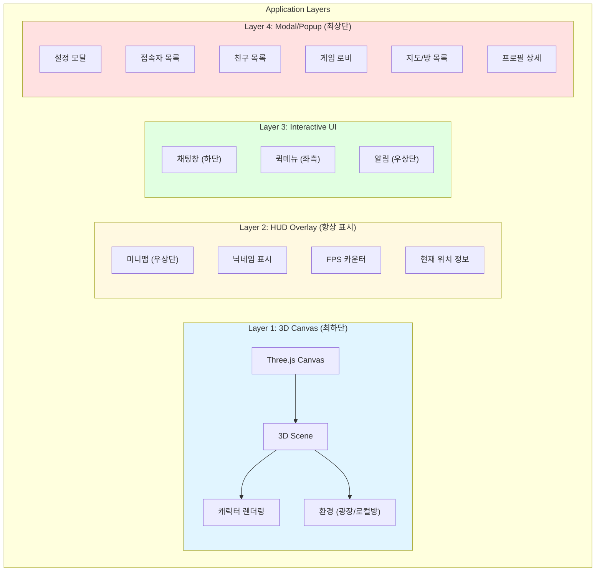

---

### 3.3 주요 사용자 시나리오

#### 3.3.1 신규 사용자 플로우

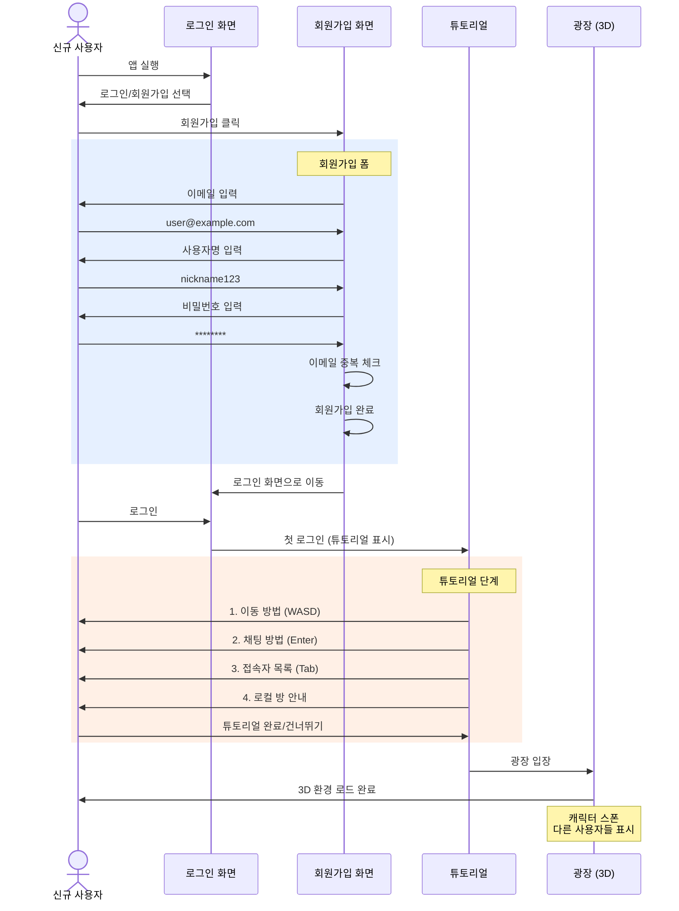

---

#### 3.3.2 로컬 방 생성/참가 플로우

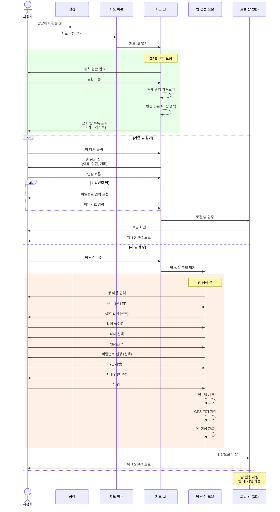

---

#### 3.3.3 미니게임 참가 플로우

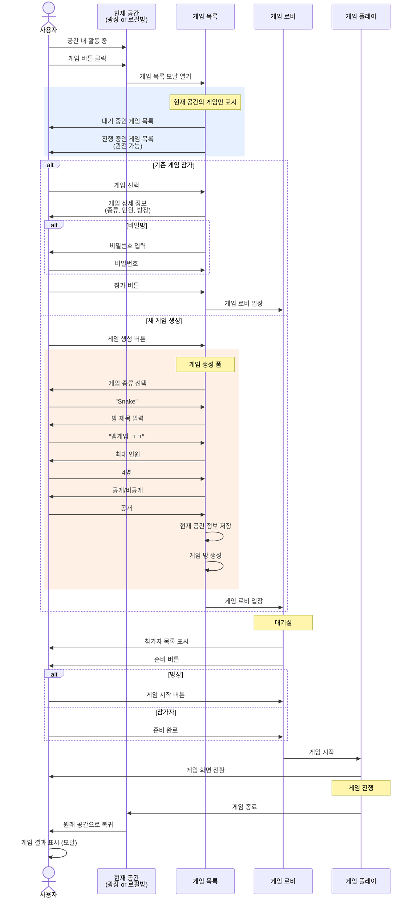

---

### 3.4 모달/팝업 우선순위 및 관리

#### 3.4.1 모달 z-index 계층

```
최상위 (z-index: 9999): 시스템 알림, 강제 로그아웃
         (z-index: 9000): 에러 모달
         (z-index: 8000): 확인 다이얼로그 (방 나가기 등)
         (z-index: 7000): 게임 로비
         (z-index: 6000): 지도/방 목록
         (z-index: 5000): 프로필 상세, 친구 목록
         (z-index: 4000): 설정 메뉴
         (z-index: 3000): 접속자 목록 (Tab)
         (z-index: 2000): 채팅창
         (z-index: 1000): HUD (미니맵, FPS 등)
최하위 (z-index: 0):    3D Canvas
```

#### 3.4.2 모달 상호작용 규칙

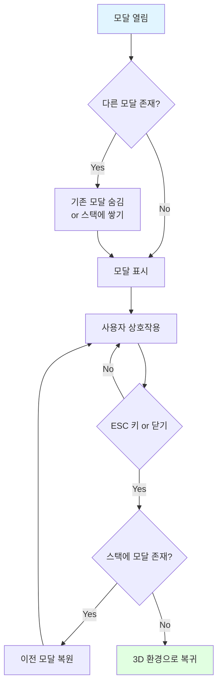

#### 3.4.3 UI 표시 규칙

**모든 모달/UI는 배타적 (하나만 표시)**

| UI 요소 | 채팅창 | 접속자 목록 | 설정 | 프로필 | 게임 로비 | 지도 |
|---------|--------|-------------|------|--------|-----------|------|
| **채팅창** | - | ❌ | ❌ | ❌ | ❌ | ❌ |
| **접속자 목록** | ❌ | - | ❌ | ❌ | ❌ | ❌ |
| **설정** | ❌ | ❌ | - | ❌ | ❌ | ❌ |
| **프로필** | ❌ | ❌ | ❌ | - | ❌ | ❌ |
| **게임 로비** | ❌ | ❌ | ❌ | ❌ | - | ❌ |
| **지도** | ❌ | ❌ | ❌ | ❌ | ❌ | - |

**규칙:**
- ❌ = 모두 배타적 (동시에 하나만 표시 가능)
- 모달 열림 시 다른 모든 UI 숨김
- ESC 키 또는 닫기 버튼으로 모달 닫기 → 3D 환경으로 복귀

---

### 3.5 반응형 UI (모바일 vs PC)

#### 3.5.1 PC 레이아웃

```
┌─────────────────────────────────────────────────────┐
│ [알림] [FPS]                    [미니맵] [현재위치] │ ← HUD
├─────────────────────────────────────────────────────┤
│                                                     │
│  [친구]                                             │ ← 퀵메뉴
│  [게임]        3D Canvas (광장 또는 로컬방)          │   (좌측)
│                                                     │
│              광장 중앙에 큰 지도 오브젝트 배치       │
│              (상호작용 시 지도 UI 오버레이 표시)     │
│                                                     │
├─────────────────────────────────────────────────────┤
│ [채팅창]                          [채팅 입력란]     │ ← 채팅
└─────────────────────────────────────────────────────┘
```

**지도 시스템:**
- 광장 3D 공간 내에 큰 지도 오브젝트 배치 (상호작용 가능)
- 지도 오브젝트 클릭 시 → 지도 UI 오버레이 표시
  - 화면 전체가 아닌 여백을 둔 오버레이 (예: 80% 크기)
  - 3D 캔버스 위에 반투명 배경 + 지도 UI
  - 채팅창, 접속자 목록 등과 동시 표시 가능

#### 3.5.2 모바일 레이아웃

```
┌───────────────────┐
│ [알림]    [미니맵]│ ← 축소된 HUD
├───────────────────┤
│                   │
│                   │
│   3D Canvas       │ ← 전체 화면
│                   │
│                   │
├───────────────────┤
│ [조이스틱] [점프] │ ← 터치 컨트롤
├───────────────────┤
│ [채팅] (접기 가능)│ ← 하단 슬라이드
└───────────────────┘

[햄버거 메뉴] → 친구, 게임, 지도, 설정 (전체화면 모달)
```

---

### 3.6 주요 화면 상태 정의

#### 3.6.1 광장 (Plaza) 화면

**필수 표시 요소:**
- ✅ 3D 캐릭터 (본인 + 다른 사용자)
- ✅ 닉네임 표시 (캐릭터 머리 위)
- ✅ 채팅창 (하단, 접기 가능)
- ✅ 미니맵 (우상단) - 로컬 방에서는 불필요
- ✅ 퀵메뉴 (좌측)
- ✅ 지도 오브젝트 (광장 중앙, 상호작용 가능)

**단축키:**
- `WASD`: 이동
- `Shift`: 달리기
- `Enter`: 채팅 입력
- `Tab`: 접속자 목록
- `ESC`: 설정
- **지도 오브젝트 클릭**: 지도 UI 오버레이 열기

**상태:**
```javascript
{
  currentSpace: 'PLAZA',
  currentRoomId: null,
  characterPosition: {x, y, z},
  nearbyUsers: [...],
  isChatOpen: boolean,
  isPlayerListOpen: boolean,
  isMapOverlayOpen: boolean, // 지도 UI 오버레이 상태
  activeModal: null | 'settings' | 'friends' | 'game'
}
```

---

#### 3.6.2 로컬 방 (Local Room) 화면

**광장과의 차이점:**
- ✅ 방 정보 표시 (방 이름, 인원)
- ✅ 나가기 버튼 (광장으로 복귀)
- ✅ 방 설정 버튼 (방장만)
- ❌ 미니맵 없음 (맵이 좁음)
- ❌ 지도 오브젝트 없음 (다른 로컬 방 직접 이동 불가)

**방장 전용 UI:**
- 👑 방 설정 수정
- 👑 사용자 강제 퇴장
- 👑 방 삭제

**로컬 방 → 다른 로컬 방 이동:**
- ❌ 직접 이동 불가
- ✅ 광장으로 복귀 → 지도에서 다른 방 선택 → 입장

**상태:**
```javascript
{
  currentSpace: 'LOCAL_ROOM',
  currentRoomId: 123,
  roomInfo: {
    name: '우리 동네 방',
    currentUsers: 5,
    maxCapacity: 24,
    isOwner: true
  },
  characterPosition: {x, y, z},
  nearbyUsers: [...],
  isChatOpen: boolean,
  activeModal: null | 'settings' | 'game'
  // 지도는 광장에서만 접근 가능
}
```

---

#### 3.6.3 게임 로비 화면

**전체 화면 모달:**
```
┌─────────────────────────────────────┐
│  [게임명: Snake]            [나가기]│
├─────────────────────────────────────┤
│  방장: nickname123                  │
│  인원: 3/4                          │
├─────────────────────────────────────┤
│  참가자:                            │
│  👑 nickname123 (방장) ✅           │
│     player2 ✅                      │
│     player3 ❌                      │
├─────────────────────────────────────┤
│  채팅:                              │
│  player2: ㄱㄱ                      │
│  player3: 준비 완료                │
├─────────────────────────────────────┤
│          [준비] or [게임 시작]      │
└─────────────────────────────────────┘
```

**상태:**
```javascript
{
  gameRoomId: 456,
  gameType: 'SNAKE',
  isOwner: true,
  participants: [
    {userId: 1, nickname: 'nickname123', isReady: true, isOwner: true},
    {userId: 2, nickname: 'player2', isReady: true, isOwner: false},
    {userId: 3, nickname: 'player3', isReady: false, isOwner: false}
  ],
  maxPlayers: 4,
  canStart: false // 모두 준비 완료 시 true
}
```

---

### 3.7 에러 및 로딩 상태 화면

#### 3.7.1 로딩 화면

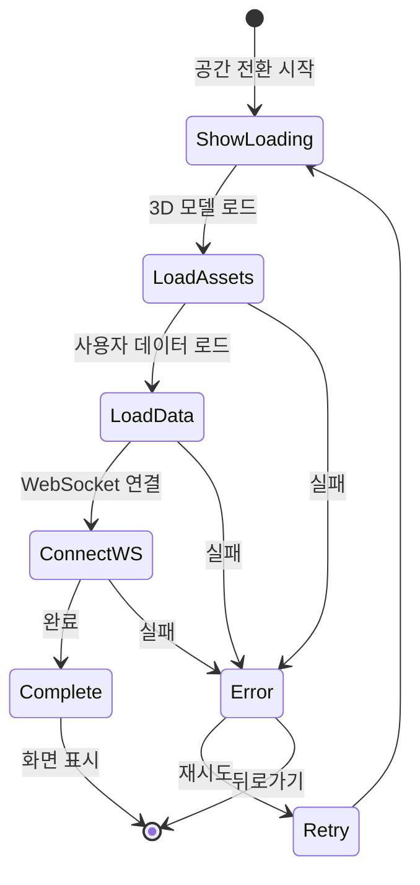

**로딩 표시:**
```
┌─────────────────────────┐
│                         │
│   [로딩 스피너]          │
│                         │
│   광장 입장 중...        │
│   (3D 모델 로드 중)      │
│                         │
│   [진행률: 75%]         │
│                         │
└─────────────────────────┘
```

---

#### 3.7.2 에러 화면

**네트워크 에러:**
```
┌─────────────────────────┐
│    ⚠️ 연결 실패          │
│                         │
│  서버에 연결할 수 없습니다│
│                         │
│  [재시도] [뒤로가기]    │
└─────────────────────────┘
```

**권한 에러 (GPS):**
```
┌─────────────────────────┐
│    📍 위치 권한 필요     │
│                         │
│  로컬 방 기능을 사용하려면│
│  위치 권한이 필요합니다   │
│                         │
│  [권한 허용] [취소]     │
└─────────────────────────┘
```

**방 입장 실패:**
```
┌─────────────────────────┐
│    ❌ 입장 실패          │
│                         │
│  • 방 인원이 가득 찼습니다│
│  또는                    │
│  • 비밀번호가 틀렸습니다  │
│  또는                    │
│  • 거리가 너무 멉니다     │
│                         │
│  [확인]                 │
└─────────────────────────┘
```

---

### 3.8 알림 시스템

#### 3.8.1 알림 종류 및 표시 위치

```
┌─────────────────────────────────────────────┐
│ [🔔 친구 요청] nickname123님이 친구 요청     │ ← 우상단 토스트
│     [수락] [거절]                    [닫기] │   (자동 숨김 시간 다양)
├─────────────────────────────────────────────┤
│                                             │
│                                             │
│               3D Canvas                     │
│                                             │
│                                             │
└─────────────────────────────────────────────┘
```

**알림 타입:**
1. **친구 요청** (인터랙션 필요)
   - 수락/거절 버튼
   - 10초 타임아웃

2. **게임 초대** (인터랙션 필요)
   - 참가/거절 버튼
   - 30초 타임아웃

3. **DM (1:1 채팅) 알림** (인터랙션 선택)
   - "nickname123님의 메시지"
   - 클릭 시 DM 창 열기
   - 5초 후 자동 숨김

4. **시스템 알림** (정보성)
   - "새로운 공지사항이 있습니다"
   - 5초 후 자동 숨김

5. **에러 알림** (경고)
   - "채팅 메시지 전송 실패"
   - 클릭 시 숨김

---

### 3.9 튜토리얼 시스템

#### 3.9.1 첫 로그인 튜토리얼 단계

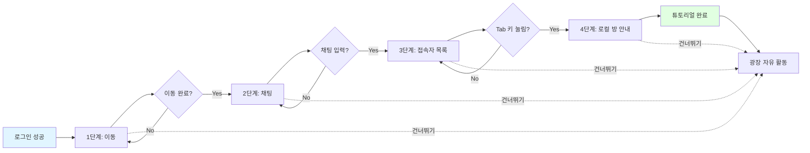

**각 단계별 UI:**

**1단계 - 이동:**
```
┌─────────────────────────┐
│  💡 튜토리얼 (1/4)      │
│                         │
│  WASD 키로 이동해보세요  │
│  Shift를 누르면 달립니다 │
│                         │
│  [건너뛰기]             │
└─────────────────────────┘
```

**2단계 - 채팅:**
```
┌─────────────────────────┐
│  💡 튜토리얼 (2/4)      │
│                         │
│  Enter 키를 눌러         │
│  채팅을 입력해보세요     │
│                         │
│  [이전] [건너뛰기]      │
└─────────────────────────┘
```

**3단계 - 접속자 목록:**
```
┌─────────────────────────┐
│  💡 튜토리얼 (3/4)      │
│                         │
│  Tab 키를 눌러           │
│  접속자 목록을 확인하세요│
│                         │
│  [이전] [건너뛰기]      │
└─────────────────────────┘
```

**4단계 - 로컬 방:**
```
┌─────────────────────────┐
│  💡 튜토리얼 (4/4)      │
│                         │
│  광장 중앙의 지도를 클릭해│
│  주변 로컬 방을 찾거나   │
│  내 방을 만들 수 있어요  │
│                         │
│  [이전] [완료]          │
└─────────────────────────┘
```

**참고:** 이모티콘 애니메이션 사용법은 별도 도움말 메뉴에서 제공

---

*다음 섹션 예정: 4. 백엔드 아키텍처, 5. API 설계, 6. WebSocket 프로토콜*

**작성일:** 2025-11-16
**버전:** v1.1 (Database + UI Flow)
